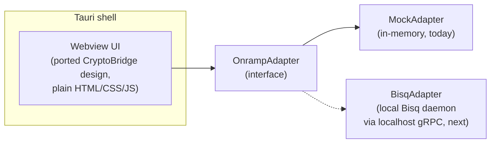

<div align="center">

# CryptoBridge Desktop

**Non-custodial desktop companion for P2P bitcoin on-ramps.**

Tauri shell · the [CryptoBridge](https://github.com/bhanneke/crypto-onramp) design system, CDN-free ·
a pluggable `OnrampAdapter` with a working mock backend, so the UI is real before Bisq is wired in.

[Design prototype](https://bhanneke.github.io/crypto-onramp/) · [Implementation plan](https://github.com/bhanneke/crypto-onramp/blob/main/docs/IMPLEMENTATION_PLAN.md) · [Report an issue](../../issues)

[](https://github.com/bhanneke/cryptobridge-desktop/actions/workflows/ci.yml)
[](LICENSE)
[](src-tauri)
[](src/vendor)

</div>

> **Status: scaffold.** The UI, the adapter interface and the mock backend work end to end
> (unit + e2e tested). No real trading backend is connected yet — that is the next milestone.
> No real money moves.

## What this is

The [crypto-onramp prototype](https://github.com/bhanneke/crypto-onramp) showed the UX; its
[implementation plan](https://github.com/bhanneke/crypto-onramp/blob/main/docs/IMPLEMENTATION_PLAN.md)
showed the only architecture that keeps a fiat→BTC on-ramp legal without licenses: an
**open-source desktop client** where trades happen on a **P2P network (Bisq)**, the fiat leg is a
**SEPA transfer between the traders' own bank accounts**, and there is **no server of ours in the
trade path**. This repository is that client's starting point — roadmap phase P1.

The load-bearing piece is the adapter seam:



The UI never talks to a backend directly. `MockAdapter` implements the interface with an
in-memory offer book, a trade state machine that walks the states a real Bisq trade has
(`OFFER_TAKEN → AWAITING_FIAT_PAYMENT → FIAT_SENT → FIAT_RECEIVED → BTC_RELEASED → COMPLETE`),
EPC069-12 (GiroCode) payment instructions for the fiat leg, and a sats-denominated wallet.
When the `BisqAdapter` lands, the UI does not change.

## Run it

**In a browser (no Rust needed)** — the UI plus mock backend is plain static files:

```bash
git clone https://github.com/bhanneke/cryptobridge-desktop.git
cd cryptobridge-desktop
python3 -m http.server 8000 -d src     # → http://localhost:8000
```

**As a desktop app** — needs [Rust](https://rustup.rs) and Node:

```bash
npm install
npm run dev        # Tauri dev window
npm run build      # signed-nothing local bundle (dmg/app on macOS, etc.)
```

**Tests:**

```bash
npm test           # adapter unit tests (node:test, no deps)
npm run test:e2e   # full-flow Playwright smoke against the system Chrome
```

## Where the trust boundaries are

Ground rules from the plan, enforced by construction here:

| Bright line | How this repo holds it |
|---|---|
| No custody | Wallet is the user's; adapter exposes balance/withdraw of *their* keys |
| No fiat handling | Fiat leg is described (`getPaymentInstructions` → IBAN + EPC QR), never executed |
| No server in the trade path | Static webview + local adapter; strict CSP, `connect-src 'self'` |
| No CDN / phone-home | Fonts vendored ([`src/vendor`](src/vendor)), Tailwind compiled to a static file |
| Open source | AGPL-3.0, same family as Bisq |

The bank-connect steps (2–3) and the explore endgame (art, yield, swap) are **demo fiction
carried over from the prototype** — kept because they demo well, clearly marked in the code,
and scheduled to be replaced by the real offer-book and payment screens.

## Project structure

```
.
├── src/                      # webview UI — also runs in any browser
│   ├── index.html            # six-step flow (ported from crypto-onramp)
│   ├── app.js                # UI layer, routed through the adapter
│   ├── adapters/
│   │   ├── onramp-adapter.js # THE interface (+ TradeState)
│   │   └── mock-adapter.js   # in-memory backend used today
│   ├── styles.css            # component layer
│   ├── tailwind.css          # compiled — regenerate via `npm run build:css`
│   └── vendor/fonts/         # Inter, JetBrains Mono, Material Symbols (subsetted)
├── src-tauri/                # Tauri 2 shell (deliberately thin, no custom IPC yet)
├── tests/                    # node:test unit tests + Playwright e2e
└── build/tailwind.input.css  # Tailwind v4 theme (design tokens)
```

## Roadmap

1. **Bisq regtest spike** *(next, independent of this repo)* — script one full BTC/EUR trade
   against a local Bisq daemon's gRPC API; decide Bisq 1 vs Bisq 2/Easy from evidence.
2. **BisqAdapter** — same interface, daemon supervision in the Rust shell, Tor bundled.
3. **Payment screen** — surface `getPaymentInstructions` as IBAN + GiroCode QR with
   Verification-of-Payee guidance, replacing the demo's instant-pay shortcut.
4. **Replace demo fiction** — offer book instead of bank picker; drop yield/art or move them
   behind a "demo" flag.

Details, threat model and the regulatory analysis live in the
[implementation plan](https://github.com/bhanneke/crypto-onramp/blob/main/docs/IMPLEMENTATION_PLAN.md).

## License

[AGPL-3.0](LICENSE) — matching the Bisq ecosystem this intends to join.
