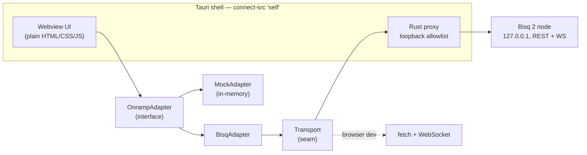

<div align="center">

# CryptoBridge Desktop

**Non-custodial desktop companion for P2P bitcoin on-ramps.**

Tauri shell · the [CryptoBridge](https://github.com/bhanneke/crypto-onramp) design system, CDN-free ·
a pluggable `OnrampAdapter` with a working mock backend, so the UI is real before Bisq is wired in.

[Design prototype](https://bhanneke.github.io/crypto-onramp/) · [Implementation plan](https://github.com/bhanneke/crypto-onramp/blob/main/docs/IMPLEMENTATION_PLAN.md) · [Report an issue](../../issues)

[](https://github.com/bhanneke/cryptobridge-desktop/actions/workflows/ci.yml)
[](LICENSE)
[](src-tauri)
[](src/vendor)

</div>

> **Status: pre-release.** A real Bisq 2 backend is wired in and live-verified — a full
> buyer-side BTC/EUR trade runs end to end through the adapter, and inside the desktop app every
> byte of that traffic goes through the Rust shell so the webview keeps `connect-src 'self'`.
> The UI is now the real flow throughout: the prototype's demo fiction has been **deleted**, not
> hidden behind a flag. What is *not* done: pairing auth, node supervision, Tor, reproducible
> builds, and the security audit. Do not point this at mainnet. No real money has moved.

## What this is

The [crypto-onramp prototype](https://github.com/bhanneke/crypto-onramp) showed the UX; its
[implementation plan](https://github.com/bhanneke/crypto-onramp/blob/main/docs/IMPLEMENTATION_PLAN.md)
showed the only architecture that keeps a fiat→BTC on-ramp legal without licenses: an
**open-source desktop client** where trades happen on a **P2P network (Bisq)**, the fiat leg is a
**SEPA transfer between the traders' own bank accounts**, and there is **no server of ours in the
trade path**. This repository is that client's starting point — roadmap phase P1.

The load-bearing piece is the adapter seam:



The UI never talks to a backend directly. `MockAdapter` implements the interface with an
in-memory offer book, a trade state machine that walks the states a real Bisq trade has
(`OFFER_TAKEN → AWAITING_FIAT_PAYMENT → FIAT_SENT → FIAT_RECEIVED → BTC_RELEASED → COMPLETE`),
EPC069-12 (GiroCode) payment instructions for the fiat leg, and a sats-denominated wallet.
When the `BisqAdapter` lands, the UI does not change.

## Run it

**In a browser (no Rust needed)** — the UI plus mock backend is plain static files:

```bash
git clone https://github.com/bhanneke/cryptobridge-desktop.git
cd cryptobridge-desktop
python3 -m http.server 8000 -d src     # → http://localhost:8000
```

**As a desktop app** — needs [Rust](https://rustup.rs) and Node:

```bash
npm install
npm run dev        # Tauri dev window
npm run build      # signed-nothing local bundle (dmg/app on macOS, etc.)
```

**Tests:**

```bash
npm test           # adapter + transport + QR unit tests (node:test, no deps)
npm run test:e2e   # full-flow Playwright smoke against the system Chrome
cargo test --manifest-path src-tauri/Cargo.toml   # loopback-proxy allowlist + live transport
```

The Bisq backend additionally has a live contract test against a real node, gated on an env var
so it no-ops in CI — see [`spike/bisq2/README.md`](spike/bisq2/README.md) for the local network:

```bash
BISQ_API_URL=http://127.0.0.1:8091/api/v1 BISQ_SELLER_URL=http://127.0.0.1:8090/api/v1 \
  node tests/bisq-adapter.contract.js               # full buyer-side trade through the adapter
BISQ_API_URL=http://127.0.0.1:8090/api/v1 \
  cargo test --manifest-path src-tauri/Cargo.toml -- --nocapture live_bisq   # REST + WS via the proxy
```

## Where the trust boundaries are

Ground rules from the plan, enforced by construction here:

| Bright line | How this repo holds it |
|---|---|
| No custody | The receive address is the user's own, typed in step 3 and checksum-validated for the right chain; we generate no address and hold no keys |
| No fiat handling | Fiat leg is described (`getPaymentInstructions` → IBAN + EPC QR), never executed |
| No order intermediation | The offer book is the network's. We rank it cheapest-first for display and take the one the user picks — no matching, no brokering |
| No yield, no advice | No such screen exists any more (see below); the e2e suite fails if one returns |
| No server in the trade path | Static webview + local adapter. The webview cannot open a socket at all — `connect-src` stays `'self'` and Bisq traffic crosses IPC to a Rust proxy pinned to loopback ([`proxy.rs`](src-tauri/src/proxy.rs)) |
| No CDN / phone-home | Fonts vendored ([`src/vendor`](src/vendor)), Tailwind compiled to a static file |
| Open source | AGPL-3.0, same family as Bisq |

Two of those lines used to be contradicted by the app's own UI. The prototype shipped an
"Earn yield" screen with a risk slider and an APY projection, plus a token swap — exactly what
*no yield* and *no advice* rule out. They are now **deleted rather than flag-gated**: a bright
line defended by a runtime flag is not much of a line, and an auditor reads the strings in the
binary, not the flag. The e2e suite fails if any of it comes back. The demo still lives in the
[prototype repo](https://github.com/bhanneke/crypto-onramp) and on GitHub Pages, which is where
a demo belongs.

## Security

The app has been through a full adversarial review — see
[docs/SECURITY_AUDIT.md](docs/SECURITY_AUDIT.md) for the threat model, the five findings and
what was done about them. The short version of the threat model: there is no server to attack,
so the attackers that matter are **the person on the other side of the trade** and **the node
you point this at**. Both supply text that ends up in a payment instruction.

Findings carry regression tests in [`tests/security.test.js`](tests/security.test.js), written
from the attacker's side. If one of those ever fails again, someone's money is at stake.

Found something? Open an issue — or, for anything exploitable, contact the maintainer directly
rather than filing publicly.

## Project structure

```
.
├── src/                      # webview UI — also runs in any browser
│   ├── index.html            # five-step flow: welcome → offers → amount+address → review → done
│   ├── app.js                # UI layer, routed through the adapter
│   ├── adapters/
│   │   ├── onramp-adapter.js # THE interface (+ TradeState)
│   │   ├── mock-adapter.js   # in-memory backend, the default
│   │   ├── bisq-adapter.js   # real backend: Bisq 2 REST + WebSocket
│   │   ├── transport.js      # I/O seam: Tauri IPC in the app, fetch/WS in a browser
│   │   ├── wallet.js         # external-wallet seam + bech32/bech32m validation
│   │   └── epc.js            # EPC069-12 (GiroCode) payloads, SEPA parsing
│   ├── styles.css            # component layer
│   ├── tailwind.css          # compiled — regenerate via `npm run build:css`
│   └── vendor/               # subsetted fonts + the dependency-free QR encoder
├── src-tauri/                # Tauri 2 shell
│   └── src/proxy.rs          # the loopback allowlist — start audits here
├── tests/                    # node:test unit tests + Playwright e2e
└── build/tailwind.input.css  # Tailwind v4 theme (design tokens)
```

## Roadmap

1. ~~**Bisq trade spike**~~ **Done (2026-07-19)** — a full Bisq Easy BTC/EUR SEPA trade ran end to
   end over Bisq 2's REST + WebSocket API, headless, no bitcoind/Tor. Decision: **build the
   BisqAdapter on Bisq 2**. Evidence and API gotchas: [docs/BISQ2_SPIKE_FINDINGS.md](docs/BISQ2_SPIKE_FINDINGS.md),
   reproducible setup in [spike/bisq2](spike/bisq2).
2. ~~**BisqAdapter**~~ **Done (2026-07-23), live-verified** — `OnrampAdapter` implemented against
   the Bisq 2 REST + WebSocket API ([`src/adapters/bisq-adapter.js`](src/adapters/bisq-adapter.js)),
   in **external-wallet mode** (the user brings a receive address; we hold no keys — see
   [`src/adapters/wallet.js`](src/adapters/wallet.js)). A full buyer-side trade drove
   `OFFER_TAKEN → … → COMPLETE` through the adapter against a live local network
   ([`tests/bisq-adapter.contract.js`](tests/bisq-adapter.contract.js)); pure logic is unit-tested
   in CI ([`tests/bisq-adapter.test.js`](tests/bisq-adapter.test.js)). Select it with
   `?backend=bisq&node=…&addr=…` in a browser, or — since the packaged app has no query string —
   the same keys in `localStorage` as `cryptobridge.backend`, `cryptobridge.node`,
   `cryptobridge.addr`, `cryptobridge.network`. The mock stays the default in both; a real
   backend is never selected implicitly, and a proper connect screen comes with the offer book. Remaining before release: pairing auth + the payment screen (below).
3. ~~**Payment screen**~~ **Done (2026-07-24)** — the trade now pauses at the fiat leg and shows a
   real payment screen: seller IBAN + a **scannable EPC069-12 GiroCode QR** (dependency-free encoder
   in [`src/vendor/qr.js`](src/vendor/qr.js), verified by decoding every output with OpenCV),
   Verification-of-Payee guidance, an honest "reputation, not multisig" trust note, and a manual
   **"I received the bitcoin"** step for non-custodial backends (external-wallet mode never
   auto-asserts receipt). Replaces the demo's instant-pay shortcut.
4. ~~**Tauri IPC transport**~~ **Done (2026-07-24)** — the packaged app could not reach a node at
   all before this: `connect-src` is `'self'`, so the webview's `fetch`/`WebSocket` to
   `127.0.0.1` were blocked, and the Rust shell had no commands. Bisq traffic now crosses IPC to
   a proxy in [`src-tauri/src/proxy.rs`](src-tauri/src/proxy.rs) that is **pinned to literal
   loopback IPs** (hostnames including `localhost` are refused, so no name resolution and no DNS
   rebinding), restricted to `/api/v1/…` and `/websocket`, follows no redirects, and has **no TLS
   backend compiled in** — CI fails if one ever enters the dependency tree. The JS side is a
   transport seam ([`src/adapters/transport.js`](src/adapters/transport.js)) so the same adapter
   runs over `fetch`/`WebSocket` in a browser and over IPC in the app. The CSP was not widened.
5. ~~**Replace the demo fiction**~~ **Done (2026-07-24)** — the flow is real end to end and is
   now five steps, not six. The PSD2 bank picker and invented account balances are replaced by
   a **live offer book** (`adapter.listOffers`) and an **amount + your-own-receive-address**
   step, with bech32/bech32m validation that rejects both a broken checksum and a valid address
   for the wrong chain. The art / yield / swap endgame is **deleted**, not flag-gated — see the
   bright-line note above. Offer text comes from a P2P network, so it enters the DOM as
   `textContent`, never as markup.
6. ~~**Security audit**~~ **Done (2026-07-25)** — first full adversarial review, against a threat
   model of a **hostile seller and a lying node** rather than a network eavesdropper.
   Five findings, all fixed, each with a regression test that fails against the old code:
   the worst let a seller inject newlines into their bank details so the **GiroCode paid a
   different account than the screen displayed**. Report: [docs/SECURITY_AUDIT.md](docs/SECURITY_AUDIT.md).
7. **Before release** — pairing auth, node supervision and Tor in the Rust shell, reproducible
   builds, and no-US distribution.

Details, threat model and the regulatory analysis live in the
[implementation plan](https://github.com/bhanneke/crypto-onramp/blob/main/docs/IMPLEMENTATION_PLAN.md).

## License

[AGPL-3.0](LICENSE) — matching the Bisq ecosystem this intends to join.
